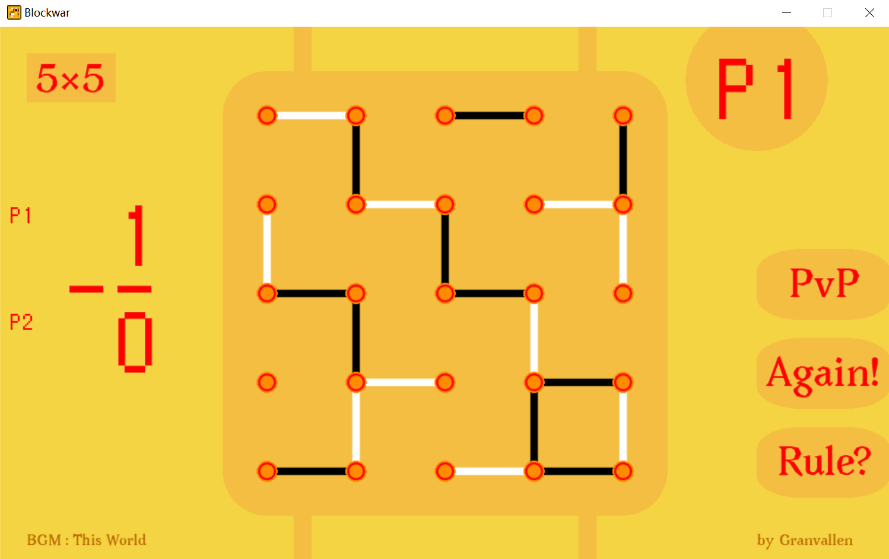
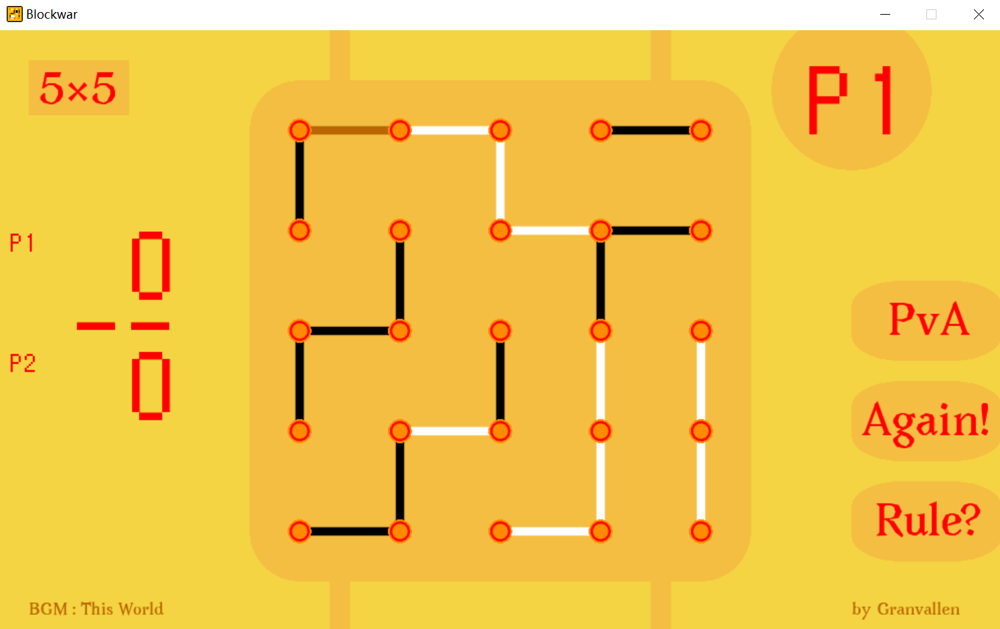
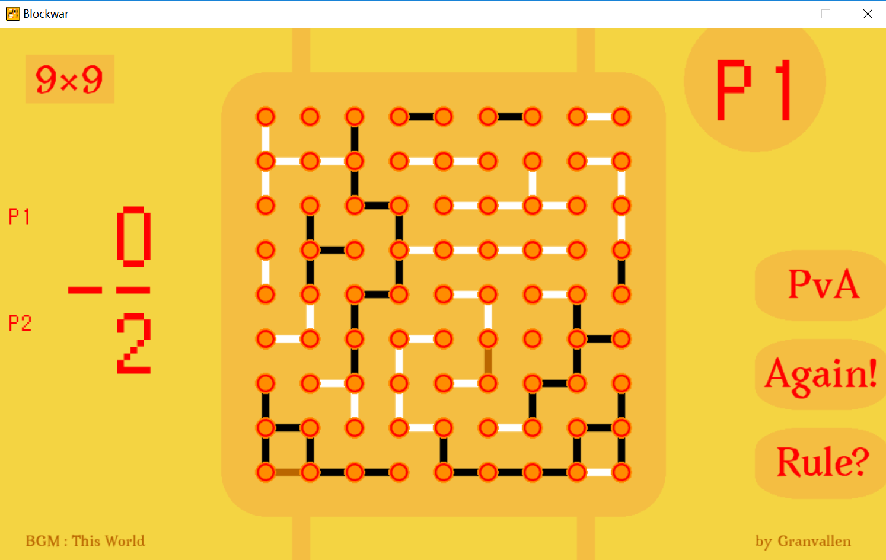
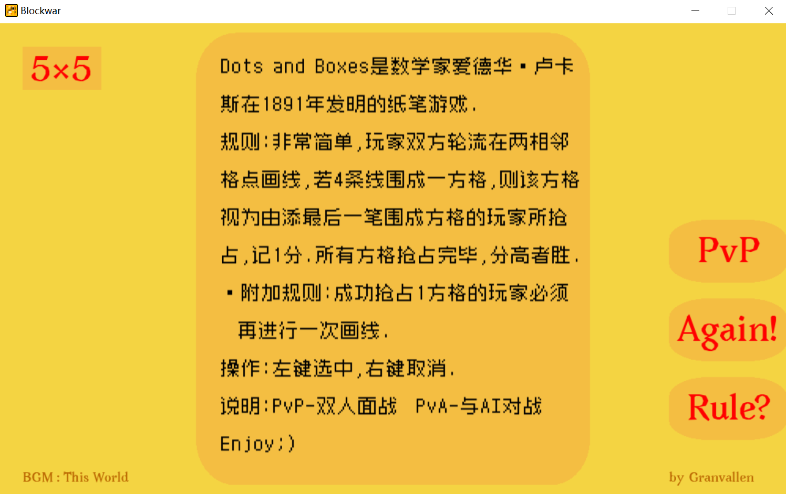

# Blockwar
love2d引擎+Lua实现的点格棋桌游, 关于[点格棋][1]

# 特性
* 实现点格棋游戏规则
* 实现本地双人对战, 内置一个简易AI, 可以虐电脑玩
* 实现棋盘尺寸可变: 4×4, 5×5, 7×7, 9×9

# 下载
从release中下载系统对应版本, 解压即可. 另外丢个[网盘][2].
关于10M的大小, 我才不会说背景加音效占了90%的容量呢...

# 操作
左键选中, 右键取消

# 界面
* 双人对战

* 人机对战

为了看清AI画的最后一笔, 故将其设置成了棕色

* 改变棋盘尺寸

点击左上角的棋盘尺寸就可以切换了

* 规则界面

# 声明
游戏的界面和图标是自己设计的(如果称得上设计的话...), 其他资源都来自网络, 可能涉及版权问题故不应商用.

[1]: https://en.wikipedia.org/wiki/Dots_and_Boxes
[2]: https://pan.baidu.com/s/1kyeNHD4dW4yKV1t--_p8Eg#list/path=%2F
